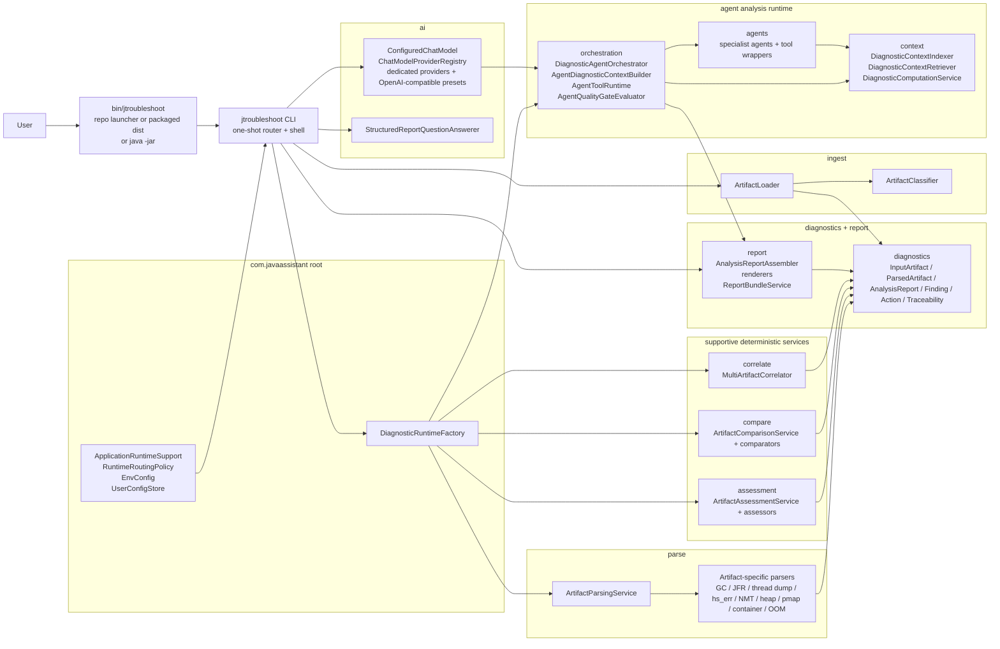
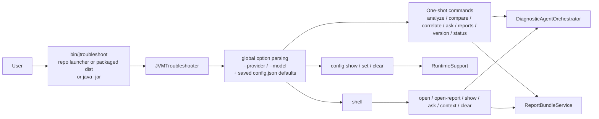
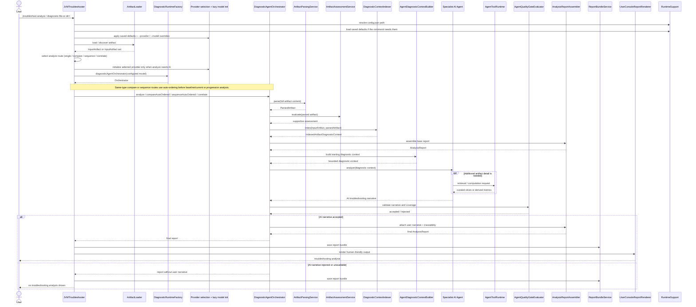

# Architecture And Control Flow

This document reflects the current consolidated package layout and the active AI-first runtime flow.

For the fastest new-session re-entry, read `docs/session-bootstrap-architecture.md` first.

## Consolidated Architecture

## CLI Invocation Flow

## Analyze Control Flow

## Notes

- The primary UX is now one-shot CLI commands. The interactive shell is explicit via `jtroubleshoot shell`.
- The packaged bundle now ships ready-to-edit `config.json` and `jtroubleshoot.env` files next to the launcher instead of relying on first-run setup commands.
- Global `--provider` and `--model` flags are resolved before command dispatch, and the actual chat model is created lazily only when an AI-backed command needs it.
- Persistent AI defaults live in `./config.json` by default. The repo launcher pins that to the project root via `-Djtroubleshoot.configFile`, while direct `java -jar` usage falls back to the current working directory unless a config-path override is supplied. Selection precedence is: CLI flags, then shell-session changes, then saved config defaults, then built-in defaults.
- Auto-routed same-type `analyze` comparisons and sequences keep the supplied order unless the runtime can safely infer a stronger older-to-newer order from parsed timestamps, filename hints, timestamped names, or filesystem modified times.
- `mvn package` now produces both the repo-local jar plus `target/jtroubleshoot-<version>-dist.zip`, where the packaged launcher lives under `bin/` and the runtime jars live under `lib/jtroubleshoot/`.
- The provider layer is now registry-driven. Dedicated provider factories cover Ollama, OpenAI, Anthropic, Google Gemini, Mistral, Azure OpenAI, OCI, and the more specialized hosted entries, while a reusable OpenAI-compatible provider implementation powers generic endpoints plus preset providers such as xAI, Groq, OpenRouter, Together AI, and Fireworks AI.
- `ingest` now owns both artifact loading and classification.
- `ai` now owns provider configuration and report-question answering.
- `report` now owns report assembly, rendering, and saved bundle persistence.
- `correlate` remains a separate package intentionally because multi-artifact synthesis is a distinct runtime concern from typed pairwise comparison.
- Raw diagnostics remain the source of truth; structured extraction and indexing exist to make that information more usable for the agents.
- Deterministic assessment remains supportive only and does not replace AI-authored troubleshooting guidance.
- JFR recordings are always parsed first; models see only derived structures and retrieved slices, never raw binary bytes.
