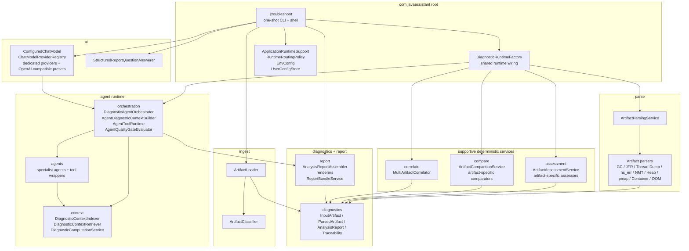
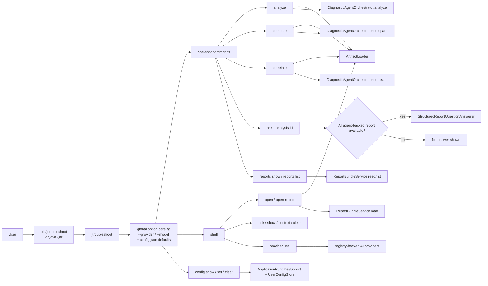
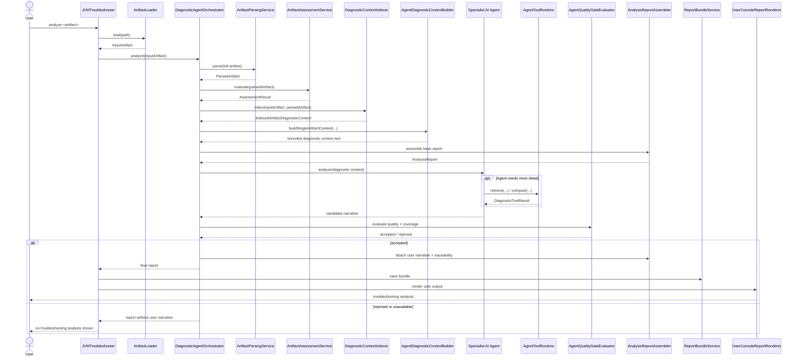
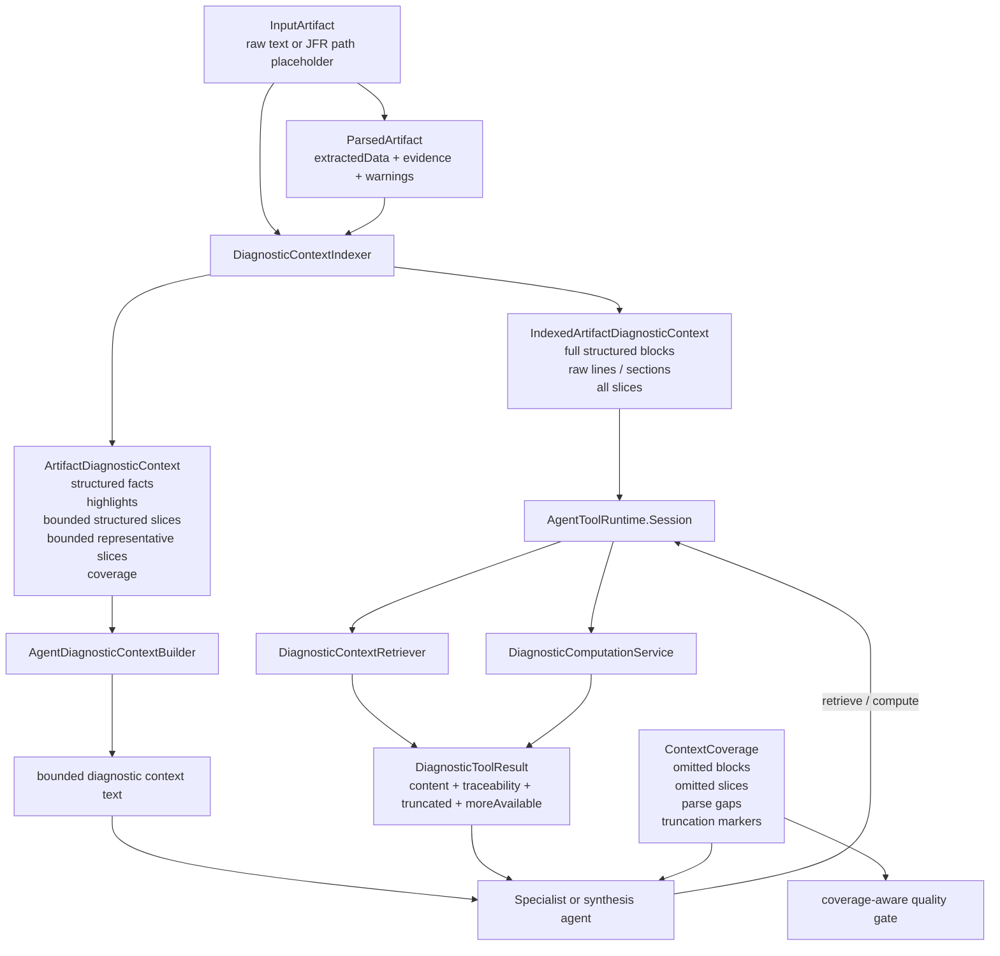
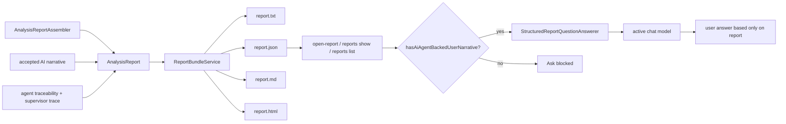
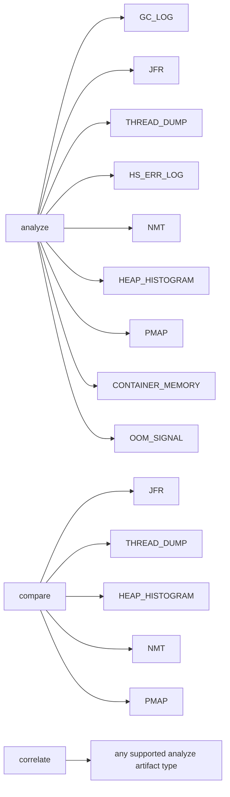

# Session Bootstrap Architecture

This file is the fastest way to rehydrate context for a new session.

## Core Design Rules

- AI agents are the primary analysis layer. User-facing troubleshooting analysis is shown only when an AI agent-backed narrative passes the quality gate.
- Deterministic parsing, assessment, comparison, and correlation are supportive infrastructure. They ground and organize diagnostics for the agents, but they do not replace AI-authored troubleshooting guidance.
- Raw diagnostic artifacts remain the source of truth.
- Structured diagnostic context is the agent working context.
- Agents can expand context only through curated retrieval and computation tools, not arbitrary file reads.
- JFR is always parse-first from the `.jfr` file on disk. The model sees derived structures and retrieved derived slices, never raw binary bytes.
- `ask` works from the saved canonical `AnalysisReport`, not from raw artifacts.
- Saved AI defaults live in `./config.json` by default. The repo launcher pins that path to the project root, and direct `java -jar` usage falls back to the current working directory unless overridden.
- `mvn package` produces both the repo-local jar layout and a packaged `target/jtroubleshoot-<version>-dist.zip` distribution with `bin/jtroubleshoot`, `config.json`, `jtroubleshoot.env`, and runtime jars under `lib/jtroubleshoot/`.

## Current Package Ownership

## Command Routing

- The CLI now resolves saved `config.json` defaults plus any `--provider` and `--model` overrides before command dispatch, and it initializes the selected AI model lazily only when an AI-backed command actually needs it.
- The provider layer is registry-driven. Dedicated factories handle Ollama, OpenAI, Anthropic, Google Gemini, Mistral, Azure OpenAI, and OCI, while the OpenAI-compatible provider implementation also backs preset hosted providers such as xAI, Groq, OpenRouter, Together AI, and Fireworks AI.

## Single-Artifact Analyze Flow

## Compare And Correlate Design

```mermaid
flowchart TB
    subgraph Compare["compare"]
        B1[baseline artifact] --> BG[ground baseline]
        C1[current artifact] --> CG[ground current]
        BG --> CMP[ArtifactComparisonService]
        CG --> CMP
        BG --> BC[baseline indexed context]
        CG --> CC[current indexed context]
        BC --> CB[comparison context builder]
        CC --> CB
        CMP --> BaseReport1[comparison base report]
        CB --> SameTypeAgent[same-artifact specialist agent]
        SameTypeAgent --> ToolSession1[tool session]
        ToolSession1 --> Gate1[quality gate]
        Gate1 --> FinalCompare[final comparison report]
    end

    subgraph Correlate["correlate"]
        ASet[multiple supported artifacts] --> GroundAll[ground each artifact]
        GroundAll --> CorrDet[MultiArtifactCorrelator]
        GroundAll --> PerArtifactIndex[index each artifact]
        PerArtifactIndex --> SpecAgents[artifact-specific specialist agents]
        SpecAgents --> SpecObs[specialist observations]
        CorrDet --> CorrBase[multi-artifact base report]
        PerArtifactIndex --> CorrBuilder[correlation context builder]
        SpecObs --> CorrBuilder
        CorrBuilder --> SynthAgent[CorrelationAgent]
        SynthAgent --> ToolSession2[correlation tool session]
        ToolSession2 --> Gate2[quality gate]
        Gate2 --> FinalCorr[final correlation report]
    end
```

## Context-Building And Tooling Lifecycle

## Saved Report And Ask Flow

## Supported Artifact Scope

## Fast Re-entry File Map

- CLI and command routing: `src/main/java/com/javaassistant/JVMTroubleshooter.java`
- Shared runtime wiring: `src/main/java/com/javaassistant/DiagnosticRuntimeFactory.java`
- Runtime policy and app metadata: `src/main/java/com/javaassistant/ApplicationRuntimeSupport.java`, `src/main/java/com/javaassistant/RuntimeRoutingPolicy.java`
- Artifact ingest: `src/main/java/com/javaassistant/ingest/`
- Parsing: `src/main/java/com/javaassistant/parse/`
- Supportive deterministic analysis: `src/main/java/com/javaassistant/assessment/`, `src/main/java/com/javaassistant/compare/`, `src/main/java/com/javaassistant/correlate/`
- Agent orchestration: `src/main/java/com/javaassistant/orchestration/`
- Context indexing and tooling: `src/main/java/com/javaassistant/context/`
- Agent prompts and tools: `src/main/java/com/javaassistant/agents/`
- Canonical report contract: `src/main/java/com/javaassistant/diagnostics/`
- Report persistence and rendering: `src/main/java/com/javaassistant/report/`
- Existing architecture doc: `docs/architecture-and-control-flow.md`
